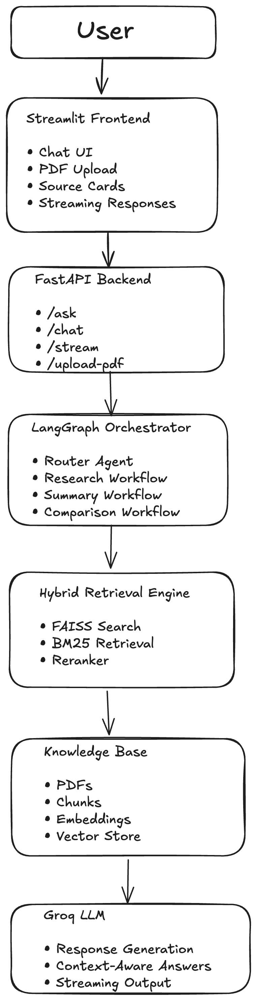
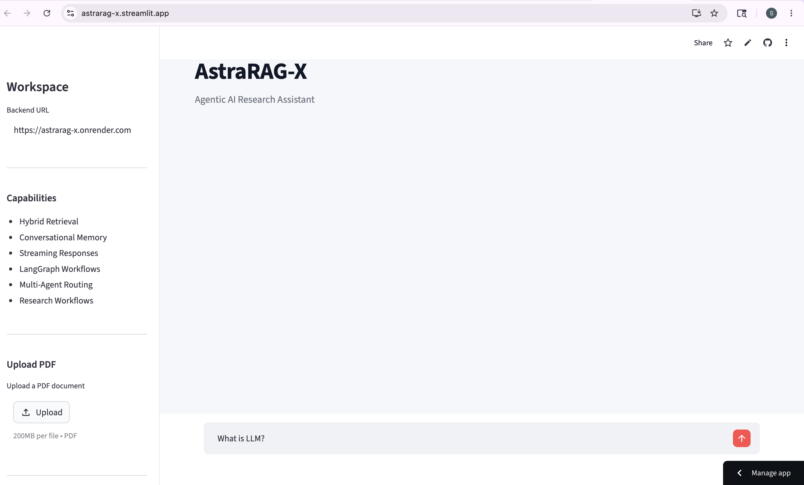
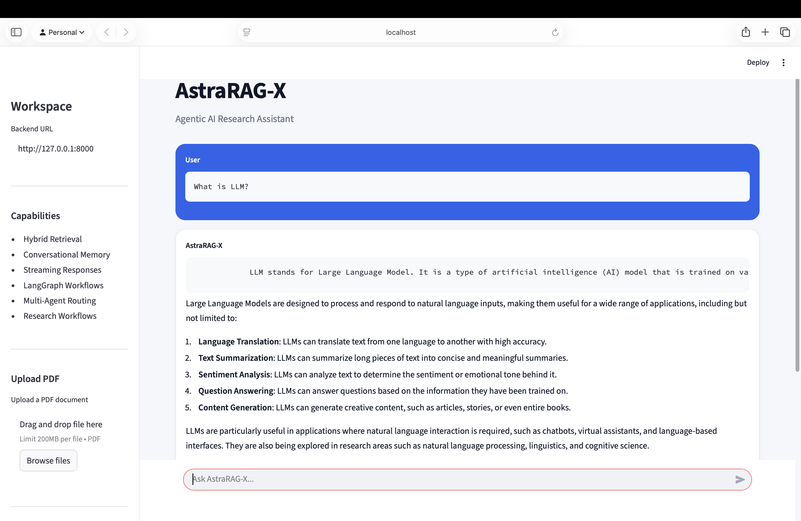
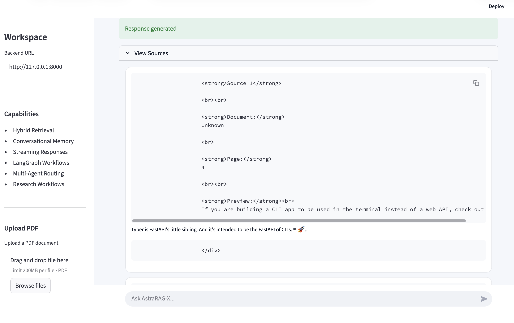
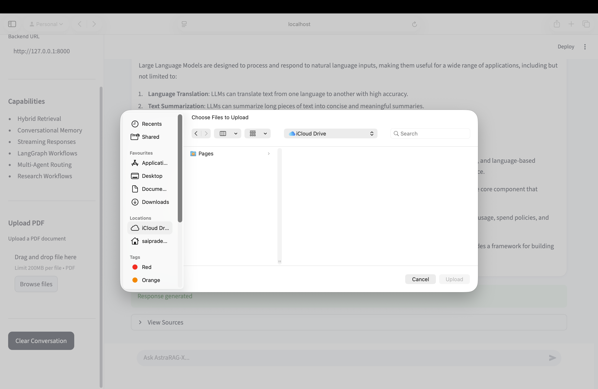
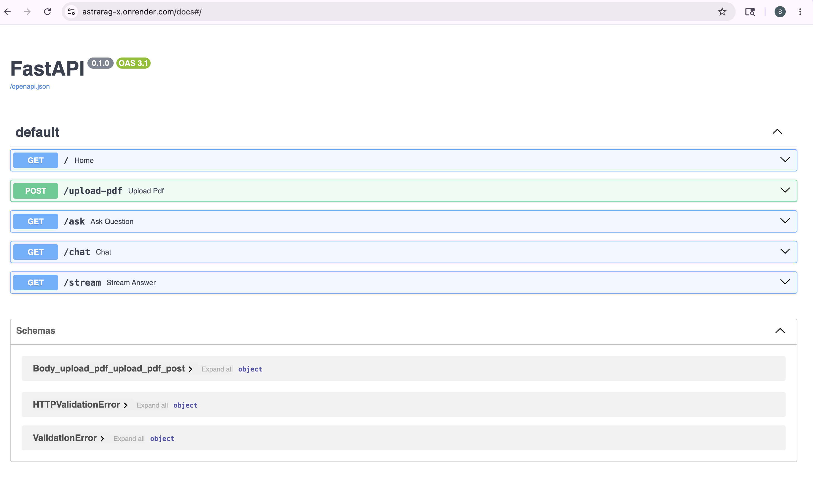

# AstraRAG-X

AstraRAG-X is a production-style Agentic AI Research Assistant built using Hybrid Retrieval-Augmented Generation (RAG), LangGraph workflows, FastAPI, Streamlit, and Groq LLMs.

The system combines semantic vector search, keyword retrieval, conversational memory, and multi-agent orchestration to generate context-aware and explainable AI responses from custom document knowledge bases.

---

## Live Deployment

Frontend: https://astrarag-x.streamlit.app

Backend API: https://astrarag-x.onrender.com

Swagger Docs:
https://astrarag-x.onrender.com/docs


---

## System Architecture



---

## Project Overview

AstraRAG-X is designed as an advanced AI research platform capable of:

- Hybrid Retrieval using FAISS + BM25
- Conversational memory handling
- Multi-agent orchestration with LangGraph
- Context-aware response generation
- Dynamic PDF ingestion
- Streaming AI responses
- Explainable source attribution
- Production-style API deployment

The project focuses on building scalable and modular GenAI system architecture rather than a basic chatbot implementation.

---

## Core Features

### Hybrid Retrieval Engine
- FAISS vector similarity search
- BM25 keyword retrieval
- Hybrid ranking strategy
- Context-aware document retrieval

### Agentic AI Workflows
- LangGraph orchestration
- Query routing workflows
- Research workflows
- Summarization workflows
- Multi-agent execution pipelines

### Conversational Intelligence
- Session-based conversational memory
- Context retention across interactions
- Follow-up query understanding

### Dynamic Knowledge Base
- PDF upload support
- Automatic chunking
- Embedding generation
- Vector indexing pipeline

### Explainable AI
- Source attribution
- Retrieved context visibility
- Transparent response generation

### Production Backend
- FastAPI REST APIs
- Streaming endpoints
- Cloud deployment on Render
- Swagger API documentation

### Modern Frontend
- Premium Streamlit interface
- Interactive chat workspace
- Sidebar document controls
- Source cards and response formatting

---

## Tech Stack

### AI / LLM
- Groq API
- LangChain
- LangGraph
- Sentence Transformers

### Retrieval
- FAISS
- BM25
- Hybrid Search Pipelines

### Backend
- FastAPI
- Uvicorn
- Pydantic

### Frontend
- Streamlit
- Custom CSS Styling

### Data Processing
- PyPDF
- Recursive Text Splitters
- Embedding Pipelines

### Deployment
- Render
- Streamlit Cloud
- GitHub

---
## Project Structure

```bash
AstraRAG-X/
│
├── app/
│   ├── agents/
│   ├── api/
│   ├── chains/
│   ├── config/
│   ├── embeddings/
│   ├── evaluation/
│   ├── ingestion/
│   ├── llm/
│   ├── memory/
│   ├── prompts/
│   ├── retrieval/
│   ├── utils/
│   ├── vectorstore/
│   └── main.py
│
├── frontend/
│   └── app.py
│
├── data/
├── storage/
├── screenshots/
├── requirements.txt
├── runtime.txt
└── README.md

```

---

# FRONTEND SCREENSHOTS

---

## Frontend Main UI



---

## Main Workspace



---


## Explainable AI Responses



---

## PDF Upload Workspace



---

## FastAPI Backend APIs



## API Endpoints

| Endpoint | Description |
|---|---|
| `/ask` | Standard RAG question answering |
| `/chat` | Conversational AI interaction |
| `/stream` | Streaming token responses |
| `/upload-pdf` | Dynamic PDF ingestion |
| `/docs` | Swagger API documentation |


---
# ENGINEERING HIGHLIGHTS

---

## Engineering Highlights

- Designed modular RAG architecture for scalability
- Implemented hybrid retrieval for improved response quality
- Integrated LangGraph for agentic orchestration
- Built explainable AI response workflows
- Deployed FastAPI backend on cloud infrastructure
- Integrated frontend-backend architecture
- Optimized deployment configurations for cloud hosting
- Implemented conversational memory pipelines

---

## Future Improvements

- Dockerized deployment
- Kubernetes orchestration
- Authentication system
- Persistent chat history
- Redis caching
- Advanced reranking models
- Multi-modal document ingestion
- Cloud-native vector databases

---

## Deployment Note

The application backend was successfully deployed using Render and integrated with Streamlit Cloud frontend deployment.

Due to free-tier infrastructure memory limitations, intensive RAG workloads involving vector retrieval and embedding pipelines may occasionally trigger backend restarts during high-memory operations.

The complete architecture functions correctly in local development environments.

---

## Author

Sai Pradeep Kala

GitHub:
https://github.com/pradeep240604

LinkedIn:
https://www.linkedin.com/in/sai-pradeep-kala-5a9068265